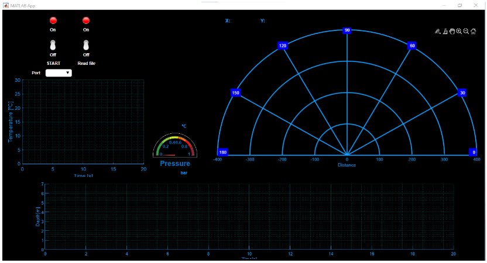
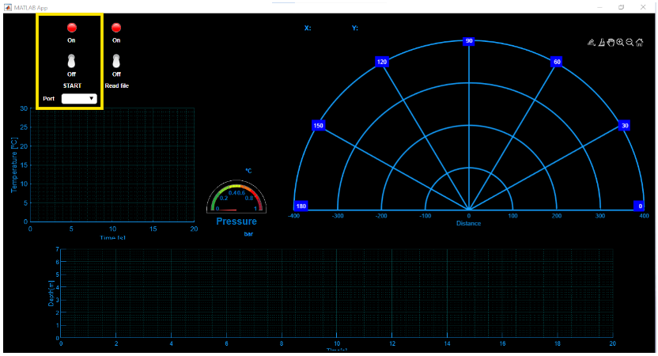
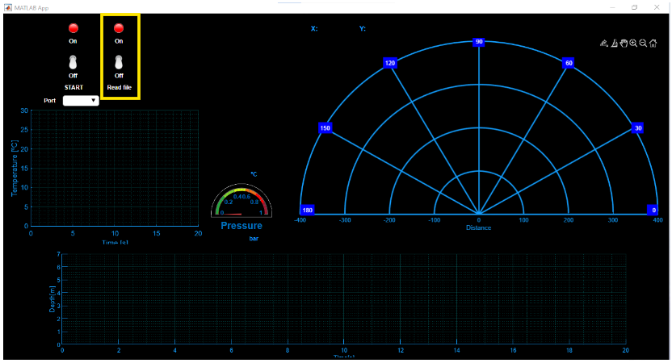
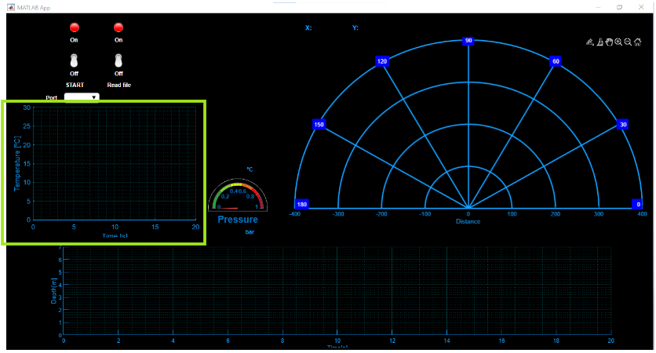
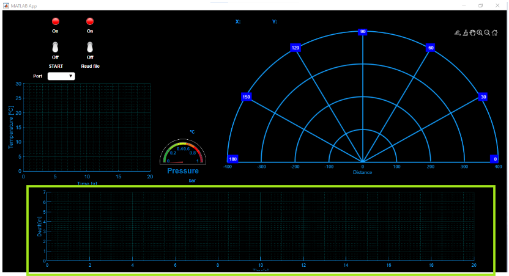
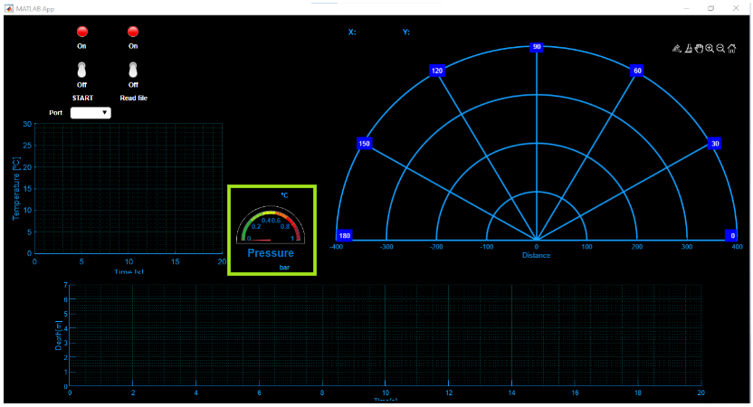
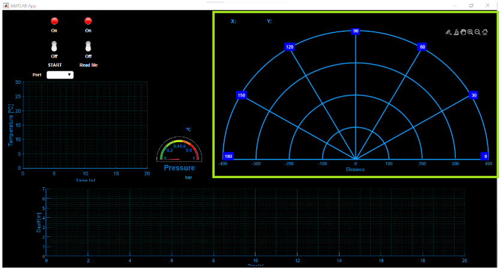

# Submarino - Proyecto post COVID-19

Proyecto realizado en otoño del 2020 en ETSETB, escuela de la Universitat Politècnica de Catalunya ([UPC](https://www.upc.edu/ca)). Para la asignatura de ENTIC.

## Tabla de Contenidos
- [Descripción](#descripción)
- [Estructura del Repositorio](#estructura-del-repositorio)
- [App Aquaprimis](#app-aquaprimis)
- [Videos demostrativos](#videos-demostrativos)

## Descripción

El proyecto se centra en capturar los datos provenientes de sensores, procesarlos y mostrarlos gráficamente en tiempo real dentro de una aplicación diseñada para analizar y visualizar el comportamiento del sistema simulado. ([aquaprimis](./Matlab/aquaprimis.mlapp))

## Estructura del Repositorio

- **Arduino:** Contiene el código relacionado con la configuración y lectura de datos de los sensores utilizando Arduino. Es ejecutado una vez para subir el código a la placa Arduino.
- **Matlab:** Incluye scripts y archivos para procesar los datos obtenidos y generar gráficos visuales
- **Multimedia:** Archivos de soporte, como imágenes, videos o documentación adicional.

## App Aquaprimis

La app consta de dos partes:

- Puedes tener una lectura a tiempo real de los sensores si abres el puerto serie correspondiente y subes la palanca de *START* a ON. Este a la vez, guardará los datos en el fichero "resultats.txt" *(Es necesario que todos los sensores y el arduino estén conectados al PC)*

- He añadido un fichero llamado "resultats.txt" para que puedas analizar sus datos. No es necesario abrir ningún puerto serial. Solo debes de subir la palanca de *Read File* a ON.

Mientras la app hace la lectura. Te mostrará los siguiente gráficos:
- Gráfico de temperatura en función del tiempo

  
- Gráfico de la profundidad en función del tiempo

  
- Gráfico de la presión así como el valor de la temperatura.

  
- Gráfico polar de la distancia que tiene el submarino hacia otro objeto

## Videos Demostrativos

- Lectura desde un fichero
  

- Lectura desde el puerto serie
  

  
